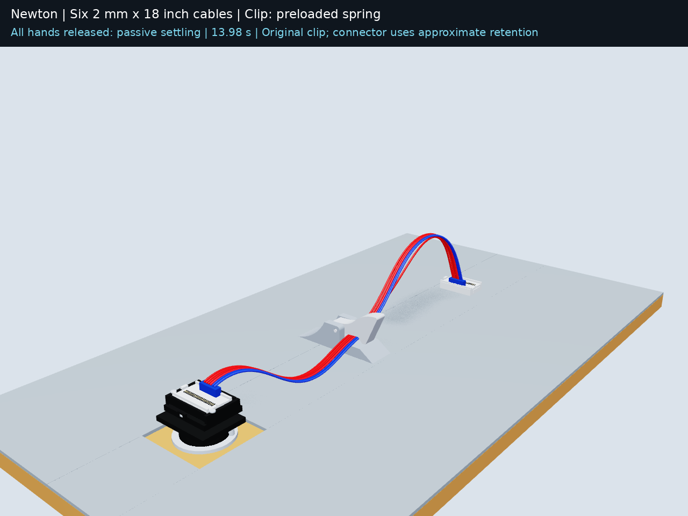
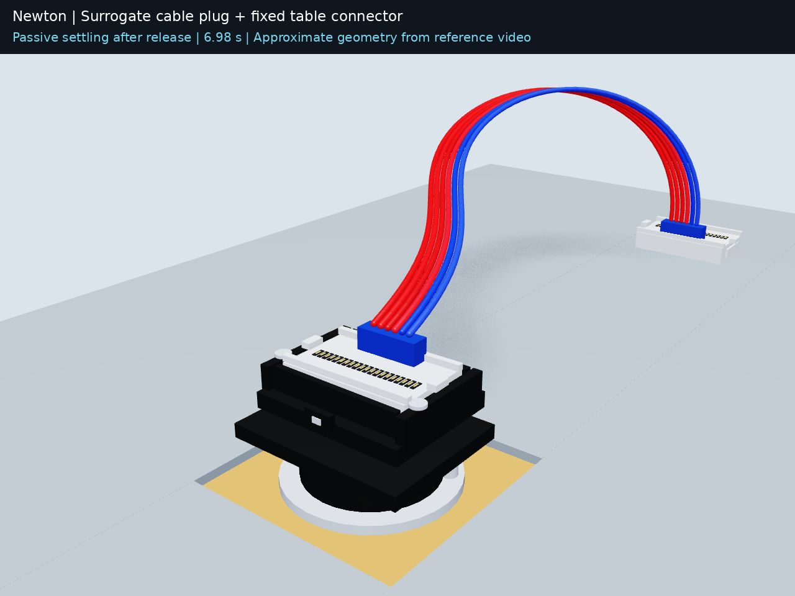
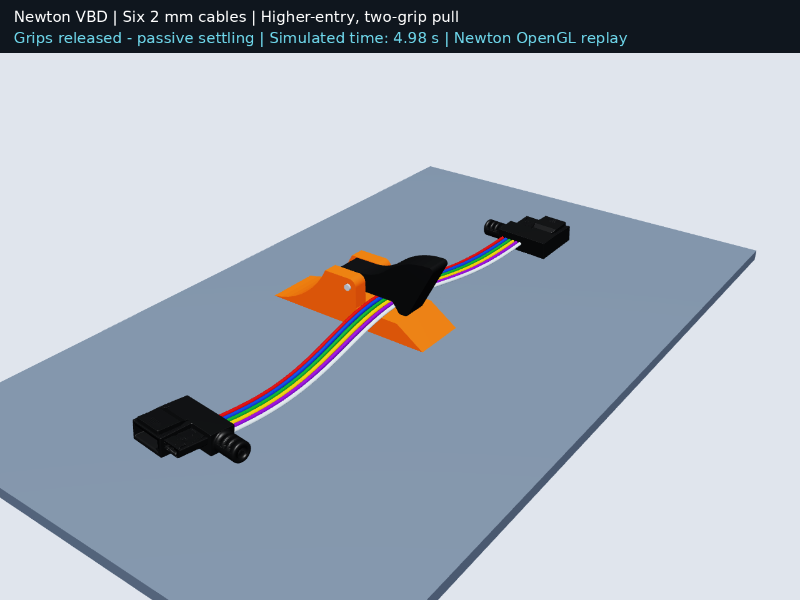
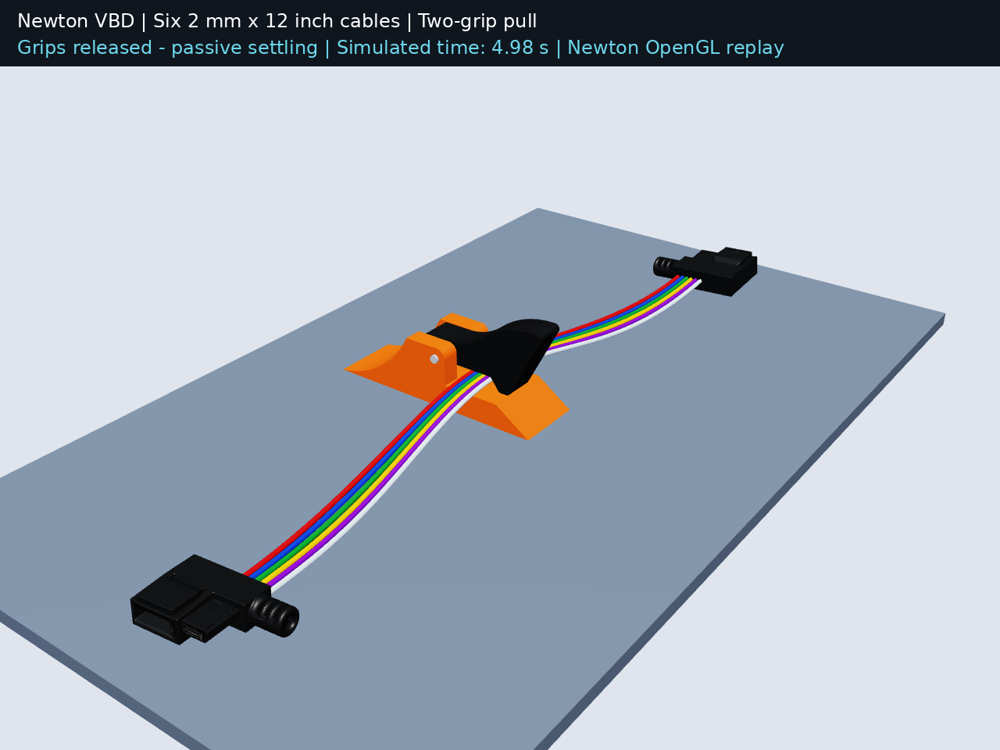
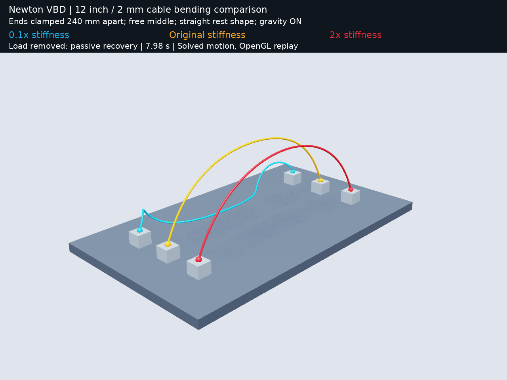
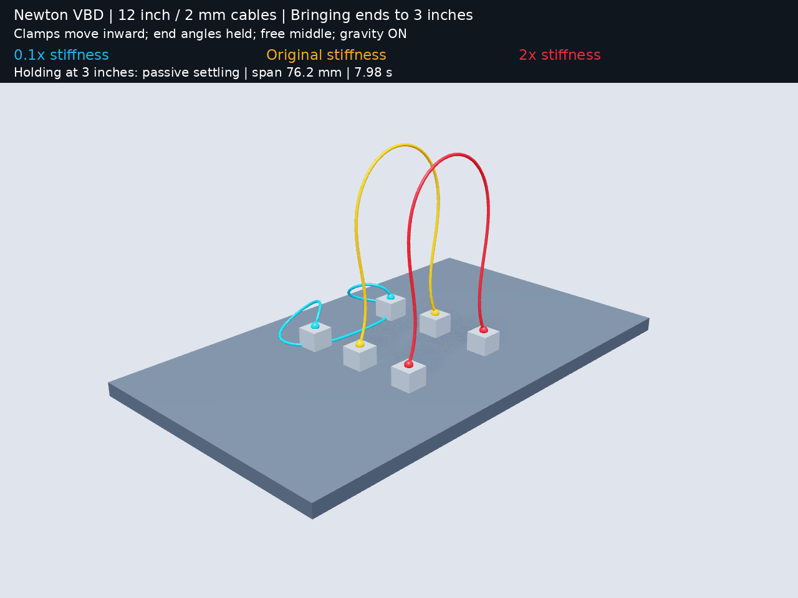

# Newton cable and clip experiments

Reproducible experiments with flexible 2 mm cables, actual clip meshes, a spring revolute hinge, and Newton rod dynamics. This repository contains the simulation code, source geometry, recorded motion, videos, USD playback, parameter documentation, and validation reports—including earlier unsuccessful diagnostic runs.

**Physics:** Newton 1.6 `SolverVBD` / rigid-body AVBD with compliant ALM, running on CUDA through Warp 1.17. The previews replay solved poses with Newton OpenGL. Isaac Sim is optional for viewing the recorded USD or rendering the baseline with RTX; it is not a second physics solver.

**Modeling correction:** the historical arch comparisons used their initial curve as the rod rest shape. Earlier straight-rest descriptions were incorrect. Both connector experiments explicitly set zero rest curvature. [Details](docs/MODELING_CORRECTION.md).

**Connector correction:** the black table receiver has no hinge. The current [fixed-receiver experiment](experiments/fixed_receiver_insertion/README.md) follows the user-confirmed motion. The earlier hinged-receiver experiment is retained as a superseded interpretation. This correction does not apply to the separate original cable-management clip.

## Results gallery

Click a preview to open its video. The recordings and numerical results are included in the repository; no GPU is needed to inspect them.

| Experiment | Preview and video | Recorded outcome |
|---|---|---|
| 18-inch cables: connector insertion **and** original spring clip | [](experiments/connector_and_clip/connector_and_clip.mp4) | All six retained with preloaded spring; lid rests 3.4° open. Original spring reopens 31.5°. Connector retention is approximate. |
| Angled plug insertion into a **fixed** table receiver | [](experiments/fixed_receiver_insertion/connector_insertion.mp4) | White plug enters tilted and rotates flat; black fixture remains fixed; hidden locking catch not modeled |
| Six 240 mm cables pulled into the actual clip | [](experiments/six_cable_newton/six_cables_newton.mp4) | All six retained; contact-disabled control keeps the lid closed |
| Six 304.8 mm / 12-inch cables, firmer material | [](experiments/long_cable_newton/actual_assets_newton.mp4) | All six retained, order preserved, original clip scale |
| 12-inch arch stiffness comparison | [](experiments/long_cable_newton/arch_comparison.mp4) | Secured ends 240 mm apart; selected material recovers after a midpoint force pulse |
| Bring endpoints to 3 inches apart | [](experiments/three_inch_arch/arch_comparison.mp4) | Selected cable settles into an arch 130.14 mm above the endpoints |

The arch comparison colors are cyan = 0.1× original stiffness, yellow = original, and red = selected 2× stiffness. Each color is an independent comparison case; the three cases do not collide with one another. The insertion experiments do simulate collisions between all six cables.

## Quick start

Tested on Linux, Python 3.12, and an NVIDIA RTX 6000 Ada GPU. A compatible NVIDIA driver/CUDA GPU is needed for the supplied simulation scripts. Offscreen rendering also requires a working OpenGL environment and FFmpeg. Install the DejaVu Sans font package if the renderer cannot find its font.

Use a separate environment from Isaac Sim. `requirements-tested-linux-py312.txt` records the complete tested dependency set; `requirements.txt` pins the two physics packages while allowing other dependencies to resolve:

```bash
python3.12 -m venv .venv
source .venv/bin/activate
python -m pip install -r requirements-tested-linux-py312.txt
python tools/check_repository.py
```

Run an experiment into a **new** directory, preserving the included reference results:

```bash
python tools/run.py connector-and-clip --output runs/connector-and-clip-01 --steps simulate validate render usd
python tools/run.py fixed-connector --output runs/fixed-connector-01 --steps simulate validate render usd
python tools/run.py three-inch --output runs/three-inch-01
python tools/run.py arch --output runs/arch-01
python tools/run.py insertion --output runs/insertion-01 --steps simulate validate render usd
python tools/run.py long-insertion --output runs/long-insertion-01 --steps simulate validate render usd
```

Each command copies the selected experiment, runs physics, validates, and renders. The insertion baseline also runs its contact-disabled control. Failed validation stops subsequent steps. Choose a fresh output directory each time.

To iterate on material or geometry, copy an experiment yourself, edit its parameters, and run its scripts:

```bash
cp -r experiments/three_inch_arch runs/my-material
# Edit runs/my-material/arch_test.py, then:
cd runs/my-material
python arch_test.py
python validate_motion.py
python render_arch.py
```

Changing span, segment count, or timing may also require updating the renderer and validation target. The supplied scripts are preserved experimental implementations, not a general-purpose cable library. See [iteration guidance](CONTRIBUTING.md).

## Parameters and evidence

- [Complete cable, contact, solver, and boundary parameters](docs/PARAMETERS.md)
- [Experiment history, controls, and limitations](docs/EXPERIMENTS.md)
- [Baseline insertion validation](experiments/six_cable_newton/validation.json)
- [12-inch insertion validation](experiments/long_cable_newton/validation.json)
- [Arch validation](experiments/long_cable_newton/arch_validation.json)
- [3-inch endpoint validation](experiments/three_inch_arch/validation.json)
- [Artifact checksums](artifact_manifest.json)
- [Asset provenance and rights](ASSETS.md)

The top and bottom clip meshes are unscaled. The hinge is at their fitted bore. The source USD scenes contain geometry/materials but no active PhysX simulation; Python constructs the Newton model. `actual_clip_playback.usdc` files contain recorded animations.

The combined 18-inch experiment adds an explicitly approximate, bounded connector-retention spring after seating, because the hidden locking catch is not reconstructed. Its assumed force limits are documented in [the experiment](experiments/connector_and_clip/README.md). The standalone fixed-receiver experiment still has no retention mechanism.

## Scope and limitations

These are qualitative, uncalibrated cable models. The input video motivated the arch behavior, but did not establish measured material properties. Arch height depends strongly on endpoint spacing, height, and orientation. The historical arch examples use an initially curved material rest state; earlier straight-rest claims are corrected above. The fixed-receiver connector example explicitly uses zero rest curvature. Endpoint clamps are prescribed; the cable middle is solved.

Validation samples recorded poses and geometry. It does not prove absence of collisions between samples or establish accurate real-world forces. A three-second settling observation is not a proof of long-term stability. The 240 mm baseline uses overlapping capsule mass; the 12-inch variants correct total mass to a continuous solid cylinder. Arch board/contact defaults differ from insertion—see the parameter document.

Earlier PhysX-only work, runtime installations, caches, customer conversations, and the private reference video are outside this Newton repository. Available Newton diagnostic recordings are retained under `archive/`, clearly separated from the validated examples.

References: [Newton source](https://github.com/newton-physics/newton), [Newton SolverVBD](https://newton-physics.github.io/newton/latest/api/_generated/newton.solvers.SolverVBD.html), [Warp](https://github.com/NVIDIA/warp).
