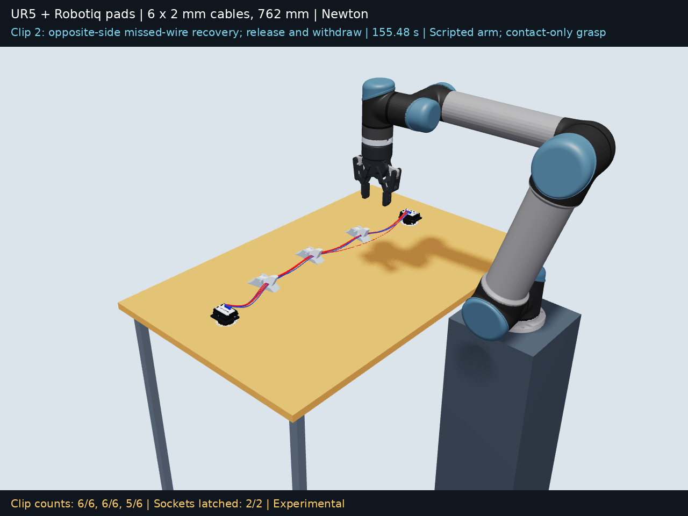

# Closer cable grasps

The main cable grasp moved from 45 mm to **30 mm** along the cable from each clip. Individual-wire recovery searches the opposite side within **29–36 mm**, favoring the protruding wire section. The clip meshes, spring, cable material, connector assets, and connector insertion are unchanged.

[Watch the complete run](ur5_cable_clip.mp4)



## Recorded result

Final channel counts are **6/6, 6/6, 5/6**, checked across every recorded frame in the final two seconds. The fully closed-lid envelope counts are **6/6, 6/6, 5/6**. Both connectors remain seated. This run includes 8 individual-wire recovery attempts.

| Clip | Final count | Wires outside (1-based) | Final lid angle |
|---|---:|---|---:|
| 1 | 6/6 | None | -0.000° |
| 2 | 6/6 | None | -0.000° |
| 3 | 5/6 | 4 | -0.001° |

The first bulk insertion left four wires inside with the lid closed. Its opposite-side recovery brought in all six. The middle insertion subsequently displaced three wires from the first clip. Later recovery pulls also changed neighboring clips. This interaction is included in the recording and is why a seated target during a pull is not treated as proof of success after release.

Compared with the earlier 45 mm run, the earlier final channel counts were 6/6, 5/6, 5/6, but the first lid remained about 71° open and only four wires fit its closed-lid envelope. The grasp search changed here and the older recording used several controller/solver stages, so this is an experimental comparison, not a controlled performance benchmark.

## Recovery log

Each target is chosen from actual simulated wire positions. The side alternates from the previous attempt for that wire. The lateral pull stops after nine consecutive frames of target retention below the closed-lid envelope, followed by release and an all-clip recheck. Limits are three recovery attempts per clip and two consecutive unsuccessful attempts per wire. Failed attempts, later slips, and exhausted budgets remain in the logs.

| Start time | Clip | Wire | Side | Selected offset | Target retained after release |
|---:|---:|---:|---:|---:|---|
| 45.5 s | 1 | 5 | -1 | -31.2 mm | Yes |
| 71.5 s | 2 | 5 | -1 | -35.1 mm | Yes |
| 83.5 s | 3 | 5 | -1 | -32.4 mm | Yes |
| 95.5 s | 3 | 4 | -1 | -32.9 mm | No |
| 107.5 s | 3 | 4 | +1 | 35.7 mm | No |
| 119.5 s | 1 | 5 | +1 | 33.1 mm | Yes |
| 131.5 s | 1 | 4 | -1 | -32.9 mm | No |
| 143.5 s | 2 | 4 | -1 | -29.8 mm | Yes |

[All recovery outcomes](recovery_outcomes.json) include the complete post-release masks for all three clips. [Motion events](motion.json) include retry-limit records.

## Validation limits

The numerical/contact audits **do not all pass**. A geometrically retained wire is not evidence that the contact solution is physically accurate.

- Maximum rod endpoint gap: 0.857 mm (0.2 mm limit).
- Maximum hinge-anchor error: 0.145 mm (0.05 mm limit).
- Maximum sampled cable/table overlap: 0.179 mm.
- Maximum sampled cable/pad penetration: 1.394 mm.
- Sampled robot/static clearance audit: pass.

See [all audit statuses](validation_summary.json), [numerical validation](validation.json), [clip contact audit](contact_validation.json), and [recovery policy check](recovery_validation.json). The clearance audits sample recorded geometry; they are not continuous swept-volume proofs.

## Reproduce and inspect

The first 31.5 seconds are the exact saved connector sequence. The 30 mm controller then runs Newton SolverVBD with compliant ALM, 80 iterations and 32 substeps per 60 Hz frame. The recording restarts after the first clip at 45.5 seconds. Poses, velocities and controller state are restored; contact warm starts are rebuilt. GPU reruns can diverge.

Run from the repository with its tested Python dependencies:

```bash
python tools/run.py ur5-closer-grasp --output runs/closer-grasp-01 --steps simulate render usd
```

Run audits separately so a failed numerical audit does not prevent rendering:

```bash
python runs/closer-grasp-01/validate_all.py
```

The six cables remain 2 mm in diameter and 762 mm long, with 152 rods each and EI = 0.0011459155902616466 N·m². Grasps use physical pad contacts, with no wire attachments or direct cable pose control. The UR5 follows scripted IK/FK targets. Socket retention uses idealized latches enabled by measured connector alignment.

`motion.manifest.json` and the chunk files preserve all solved 60 Hz arrays without edits. `two_connectors.npz` is the starting checkpoint. [Recording provenance](recording_provenance.json) verifies the unchanged connector prefix. The MP4 replays solved poses with Newton OpenGL; the USD files are visual playback and contain no active PhysX simulation.
