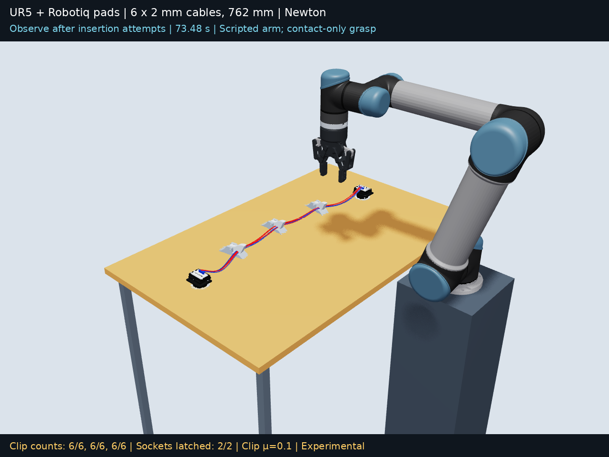

# Lower clip friction

Clip friction was reduced from **0.5 to 0.1** on both halves and the entry supports of all three clips. Cable friction remains 0.5, pad friction 1.0, and table friction 0.5. Newton's rigid contact material combination uses the geometric mean, so effective cable–clip friction changes from **0.5 to 0.223607**.

The 30 mm bundle grasps, 29–36 mm opposite-side recovery search, original clip geometry, spring, cable stiffness, solver settings, and restart boundaries match the [closer-grasp baseline](../ur5_closer_grasp/README.md). Conditional retries depend on the simulated wire positions.

[Watch the complete run](ur5_cable_clip.mp4)



## Comparison

| Measurement | Previous clip μ = 0.5 | Clip μ = 0.1 |
|---|---|---|
| Final retained counts | 6/6, 6/6, 5/6 | 6/6, 6/6, 6/6 |
| Fit below a fully closed lid | 6/6, 6/6, 5/6 | 6/6, 6/6, 6/6 |
| Individual-wire recovery attempts | 8 | 1 |
| Simulation duration, including connector prefix | 155.5 s | 73.5 s |
| All physics/contact audits pass | False | False |

The final counts require each wire to remain inside for every recorded frame in the last two seconds. Lid-envelope counts are a separate geometry check. This is one recorded trial per coefficient; the detailed [comparison data](comparison.json) includes numerical errors and retry limits.

| Clip | Final retained count | Wires outside (1-based) | Final lid angle |
|---|---:|---|---:|
| 1 | 6/6 | None | -0.000° |
| 2 | 6/6 | None | -0.000° |
| 3 | 6/6 | None | -0.000° |

## Actual-position recovery

Every insertion is checked after release. Missing wires trigger a grasp on the opposite longitudinal side, favoring the protruding segment. The lateral pull stops after nine consecutive frames of retention below the closed-lid envelope, then releases and rechecks every clip. The run allows three attempts per clip and two consecutive failed attempts per wire. Retry limits and unsuccessful outcomes remain in the recording.

| Start time | Clip | Wire | Side | Selected offset | Target retained after release |
|---:|---:|---:|---:|---:|---|
| 59.5 s | 3 | 6 | -1 | -31.7 mm | Yes |

[Recovery outcomes](recovery_outcomes.json) preserve all-clip post-release masks. [Motion events](motion.json) preserve retry-limit records and target selections.

## Validation

The numerical/contact audit result is **fail**. Geometric retention does not establish physical accuracy when contact or joint tolerances fail.

| Maximum error | Previous μ = 0.5 | Clip μ = 0.1 |
|---|---:|---:|
| Rod endpoint gap | 0.857 mm | 0.483 mm |
| Rod endpoint gap in final two seconds | 0.0015 mm | 0.0016 mm |
| Hinge anchor error | 0.145 mm | 0.003 mm |
| Sampled cable/clip penetration | 1.066 mm | 0.851 mm |
| Sampled cable/pad penetration | 1.394 mm | 0.949 mm |
| Sampled cable/table overlap | 0.179 mm | 0.000 mm |

[All audit statuses](validation_summary.json), [numerical report](validation.json), [clip contacts](contact_validation.json), and [gripper contacts](gripper_contact_validation.json) contain the measurements and methods. Contact checks sample recorded geometry; they are not continuous collision proofs.

## Reproduce

The exact 31.5-second seated-connector prefix is reused from the baseline, with the reduced coefficient applied from that checkpoint onward. The run restarts again at 45.5 seconds, matching the baseline. Poses, velocities, and controller state are restored; solver contact warm starts are rebuilt. No cable poses are edited. The unchanged controller uses 80 solver iterations and 32 substeps per 60 Hz frame during cable insertion.

```bash
python tools/run.py ur5-low-friction --output runs/low-friction-01 --steps simulate render usd
python runs/low-friction-01/validate_all.py
```

Run audits separately because failures intentionally return nonzero. `simulate.py --clip-friction` exposes the clip coefficient for further experiments. `reproduce_recording.py` supplies 0.1 and the recorded restart boundaries. The runtime [material check](clip_materials.json) verifies the coefficient on all 210 clip collision shapes.

The six cables are 2 mm in diameter and 762 mm long, with 152 rods per cable and EI = 0.0011459155902616466 N·m². The UR5 follows scripted IK/FK targets; grasps use pad contacts without attachments or cable pose control. Socket locks are idealized latches enabled by measured connector alignment.

The lossless `motion.manifest.json` chunks preserve the complete 60 Hz recording. [Provenance](recording_provenance.json) verifies the unchanged connector prefix. The MP4 replays solved poses using Newton OpenGL, and the USD is visual playback without active PhysX simulation. [Playback integrity](playback_validation.json) is checked separately from physics accuracy.
