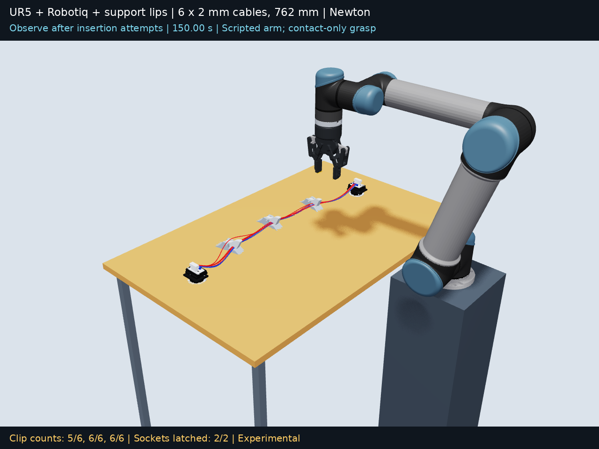

# UR5 assembly of a harness through three clips

This experiment starts six 762 mm (30 inch), 2 mm cables and both attached end connectors on a solid tabletop. A scripted UR5 with a Robotiq 2F-85 installs the connectors into two fixed sockets one at a time, then attempts to route the bundle through three original spring clips arranged in a shallow arc. Final retention is checked in all three clips after the robot withdraws.

The connector geometry is an approximate reconstruction from the reference footage. The black sockets are fixed; each white connector approaches at 25 degrees and rotates down. A raised T-shaped handling rib was added to each white connector to give the fingers clearance above the socket walls. The fingers retain the physical support lips used in the preceding experiment. These modifications are modeled collision geometry, not a claim that the stock connector and gripper can perform the same grasp.

## Recorded result

Both connectors were installed one at a time. Final retention, required throughout the last two recorded seconds, is **5/6, 6/6, 6/6** in clips 1, 2 and 3. The full 150.02 s recording includes the failed connector attempts, corrected seating path, physical wrist unwind, clip feeds and recovery attempts. Earlier poses were preserved exactly across saved-state restarts; contact-history warm starts were reset. One strand remains above the first closed lid. The later low and tilted recoveries disturbed already-seated cables, so their branches are retained separately.

[Full recorded video](ur5_cable_clip.mp4) · [Measured retention over time](retention_timeline.png) · [Validation](validation.json) · [Recording provenance](recording_provenance.json)

Strict validation **does not pass**. Maximum sampled cable/clip overlap is 0.794 mm, cable/pad-or-support overlap is 0.787 mm, and connector/socket-or-pad overlap is 1.594 mm; the limit is 0.2 mm. The maximum cable-joint gap across the whole development recording is 0.461 mm. During the final two seconds it is 0.0007 mm. The sampled robot/table penetration is 0.000 mm. These are geometric checks, not measured forces or a hardware-ready plan.

The selected branch is `assembly_recovery`, with per-segment iteration counts 80 → 80 → 80 → 80 → 40. The 40-iteration recovery exceeded the cable-joint error criterion. Additional 80-iteration low-entry and tilted-grasp tests are retained separately under `diagnostics`; the measured branch comparison is in `selection.json`. Per-controller errors are retained in `validation.json`. Contact failures in earlier attempts remain part of the full recording's audit rather than being hidden by the final task state.

## Sequence and geometry

In the default fresh-run controller, the two connector sequences occupy 1.5–16.5 and 16.5–31.5 seconds. Each follows the loose connector during approach, closes around its handling rib, lifts, moves above its socket, lowers at an angle, rotates down, releases and withdraws. An idealized fixed capture joint engages only when the actual connector is within 1.5 mm and 6 degrees of the seated pose. The check continues through release because contact slip can delay seating. The next task stops if a required connector has not latched. After lifting and again above the socket, the controller measures the connector pose relative to the tool. During rocking, the nominal plug path keeps its front top corner 0.5 mm inside the front wall and its leading lower edge at floor height. A 60 Hz pose correction integrates 12% of measured position/orientation error per step, bounded to 8 mm total translation, 20 degrees total rotation and 0.75 degrees per step. Forces reach the connector through finger contacts only. The geometric comparison is recorded in `seating_path_check.json`.

In that fresh-run schedule, three cable sequences start at 31.5, 45.5 and 59.5 seconds. The gripper tracks cable material sections approximately 45 mm downstream of each clip, closes to a 5.99 mm pad gap, lifts, aligns and feeds the bundle sideways. A bounded additional feed responds to the geometric entry check. The gripper releases and returns home between clips. All three clips are checked again after the last withdrawal; entering a clip earlier is not sufficient for final success.

The table spans X = −300..350 mm and Y = −120..900 mm. Socket seat centers are (−25, 15, 30.5) and (−25, 760, 30.5) mm. Clip channel centers are (−65, 195, 14), (−80, 385, 14) and (−65, 575, 14) mm. The first and last clips are yawed approximately ±9.65 degrees. The original clip meshes are unscaled. The dynamic lid uses the authored 68 convex prisms; the fixed bottom uses its triangle mesh and authored entry support. `actual_clip_scene.usda` supplies these local asset shapes, while `ur5_playback.usdc` is the assembled recording. Layout and dimensions are design assumptions.

The included development recording has retries: the first socket locks at 41.92 s and the second at 56.92 s. Clip feeds begin at 63.02, 77.02 and 91.02 s; upstream recoveries begin at 105.02, 119.02 and 133.02 s. A fresh `simulate.py` run uses the revised controller from the beginning and is not a replay of this development history.

## Physics and control

Newton SolverVBD with compliant ALM provides cable, connector, spring-joint and contact dynamics. The initial assembly uses 80 iterations at 3840 Hz. The first upstream recovery test uses 40 iterations at the same timestep and with the same physical parameters. It exceeded the 0.2 mm cable-joint error limit, and additional recovery tests restore 80 iterations. The selected reference and solver counts are recorded in `selection.json` and `recording_provenance.json`. Pose feedback reads exact simulated transforms. The UR5 follows kinematic joint poses computed with numerical IK, and the Robotiq fingers follow its four-bar kinematics. Grasps use contact and friction; neither connectors nor cables are attached to the robot. Both cable ends have fixed material attachments to their respective 15 g connectors. The socket locks are idealized constraints rather than a reconstruction of a concealed mechanical latch.

Each cable contains 152 capsule segments of length 5.01316 mm, with 1 mm radius, effective density 1000 kg/m³ and about 2.394 g mass. Rod rest curvature and twist are zero. Bend rigidity EI is 0.0011459155902616466 N m². Segment bend/twist stiffness is EI divided by segment length; damping is 0.005729577951308233 × 0.005 divided by segment length. Stretch/shear stiffness is 1e6 N/m, with damping 0.1 N s/m.

Contacts use stiffness 1e6 N/m and damping 100. Cable/fixture friction is 0.5; pad/support friction is 1.0. Contact-generation gaps are 0.2 mm for cables/fixtures and 0.1 mm for pads. Each clip uses spring stiffness 0.114591559 N m/rad, damping 0.002864789 N m s/rad, constant closing preload 0.03 N m and angular limits −75..0 degrees. These are uncalibrated parameters retained from the earlier experiment.

Each fingertip support projects 2.5 mm inward, is 22 mm wide and has a 0.10 mm leading thickness increasing to 1 mm at the back. The TCP lies 1.05 mm above the original pad tips. Connector pickup targets a point 14 mm above the connector origin and 5 mm toward its front; the pad gap closes to 27.8 mm around a 28 mm handling rib. Gripper force limits, actuator compliance, robot self-collision avoidance and perception are not modeled.

## Run and inspect

The observed runs took roughly 40–60 wall-clock seconds per simulated second on the shared RTX 6000 Ada host. `motion.json` reports runtime for the final invocation only; the preserved prefix was simulated in earlier invocations.

With the repository environment installed, run `python simulate.py`, then `python render.py` and `python export_playback.py` in this experiment directory. After both media exports exist, `python check_playback.py` checks sampled USD transforms and MP4 format against the motion data. This is separate from physical validity. Run `python validate_all.py` to execute all five audits. Individual audits are `validate.py`, `check_clip_contacts.py`, `check_gripper_contacts.py`, `check_connector_contacts.py` and `check_robot_clearance.py`. Each audit writes its own JSON report and returns nonzero on failure. Geometric task completion does not waive a contact or numerical failure.

The simulation writes task-boundary checkpoints. `make_checkpoint.py` can also reconstruct a saved boundary from the reference motion arrays and `restart_states.npz`. `--resume <checkpoint.npz>` continues from saved body positions and velocities and keeps the prior recorded frames. Contact-history warm starts are reset on restart; such a continuation can differ from an uninterrupted trajectory and is reported explicitly. Controller-only revisions can be tested at these boundaries. Do not reuse a checkpoint after changing geometry, body topology or physical parameters.

The archived `controller_initial_attempt.py` and `controller_pose_calibrated_attempt.py` preserve the two earlier connector-controller revisions. Their fixed-pivot entry path intersected the front stop, and the recorded attempts did not latch. `controller_seating_path_attempt.py` preserves the revision that seated both connectors, followed by a wrist-winding limit during return. The current controller explicitly chooses the safe yaw direction on that return. The reference continues from the last complete saved state with a three-second free-space wrist unwind using `--recover-home`; the prior body poses and velocities are retained. `controller_threeclip_attempt.py` preserves the first three-clip pass, and `controller_upstream_recovery.py` preserves its opposite-side corrections. `recording_provenance.json` identifies the development segments, solver iteration counts and verified checkpoints. Negative contact-count samples mean that telemetry was unavailable in an earlier checkpoint; pose arrays remain complete.

Targeted recovery uses `--resume <checkpoint.npz> --repair-clips 1 2 3 --iterations 40 --seconds <global-end-time>`. It selects the missed strands at each requested clip, tracks material points about 45 mm upstream, closes around their local bounding span, and pulls inward and down. The failed `--low-entry` variant first resets the grasped strands outside the mouth, moves the hand to 35 mm upstream and 4 mm above the world origin (3 mm above the tabletop), then feeds inward. The first simple upstream pull passed the high stray strand over the closed lid, motivating this alternative. The low variant then disturbed the other clips and is preserved separately as a failed branch. The 5.99 mm pad gap keeps the support lips separated. It releases and withdraws before checking the resulting retention; a recovery can affect other clips.

The experimental `--angled-bundle` variant returns to the saved pre-low-entry state and grasps all six strands 28 mm upstream with the tool tilted 35 degrees. It closes to 5.99 mm, feeds toward channel height, opens only to 20 mm before lifting, then opens farther in free space. Its planned joint-speed and table-clearance preflight passed; the recorded checks remain authoritative.

`restore_diagnostic.py` reconstructs the failed low-entry branch from the shared reference prefix and `diagnostics/lower_entry_tail.npz`, verifying every array hash. Its source is `controller_low_single.py`. Use `--name angled_bundle` to reconstruct the tilted-grasp branch. `selection.json` records the measured branch comparison; selecting a branch does not waive its numerical failures. This keeps the failed physics available without duplicating the common 150-second prefix.

The separate `simulate_clip_trial.py` is a diagnostic initialized with both connectors seated. It does not demonstrate connector installation and is not the full assembly recording.

MP4 output renders solved Newton poses offscreen. USD exports are visual playback for Isaac Sim with pose samples at 15 Hz and interpolation, and contain no active PhysX simulation. Full 60 Hz arrays are retained separately; public distribution splits them into lossless NPZ chunks, reconstructed by `motion_io.py`. The reference video and private customer correspondence are not included.

## Assets

The original `clipTop.stl` and `clipBottom.stl` are retained without scaling. Connector sockets, raised handling ribs, tabletop and fingertip supports are approximate or procedural geometry. UR5 CB3 assets are from ROS-Industrial universal_robot commit `39ad110d8f2e8f66856a201cca88aa7a7025e3eb`, under BSD-3-Clause. Robotiq geometry and linkage dimensions are from MuJoCo Menagerie commit `4d038b3feae26ec82b46a4d586379114012a8ac7`, under BSD-2-Clause. Licenses and provenance are retained under `robot_assets/`.
